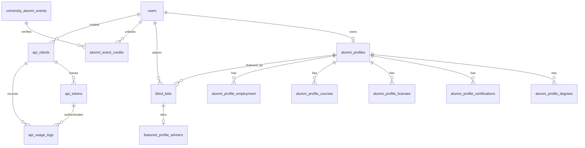

# Database Schema

The SQLite design is normalized so repeatable profile sections and blind-bid records are separated into their own tables instead of being embedded inside one large row.

## Entity relationship overview

## Main tables

### `users`

- stores account identity and password hashes
- stores hashed verification/reset tokens plus their expiry times

### `alumni_profiles`

- one profile per user
- stores biography, LinkedIn URL, location, headline, image path

### `alumni_profile_*`

- `degrees`
- `certifications`
- `licenses`
- `courses`
- `employment`

These tables support multiple-entry profile sections while preserving 3NF-style separation.

### `blind_bids`

- stores one bid per user per featured day
- stores bid amount, status, resolution timestamp, and notification timestamp

### `university_alumni_events`

- stores verified university alumni events for each month
- stores hashed attendance codes used to prove participation before granting the extra appearance

### `alumni_event_credits`

- stores one verified alumni-event participation credit per user per month
- lets the bidding logic raise the monthly appearance allowance from 3 to 4

### `featured_profile_winners`

- stores the single winner selected for each featured day
- supports the public featured alumnus API and monthly appearance-limit checks

### `api_clients`

- stores developer/client registrations owned by a logged-in user

### `api_tokens`

- stores hashed bearer tokens, token prefixes, scopes, status, expiry, and timestamps

### `api_usage_logs`

- stores endpoint usage history, timestamps, outcomes, IP, and user agent

## Indexing highlights

The application creates indexes for the most common lookups:

- verification and reset token searches
- profile-by-user lookups
- blind bids by feature date and status
- verified university events by month
- alumni-event credits by user and month
- featured winners by feature date
- API tokens by client and status, plus expiry checks
- API usage logs by client and usage time

These indexes help authentication, bidding resolution, and developer analytics stay efficient as data grows.
