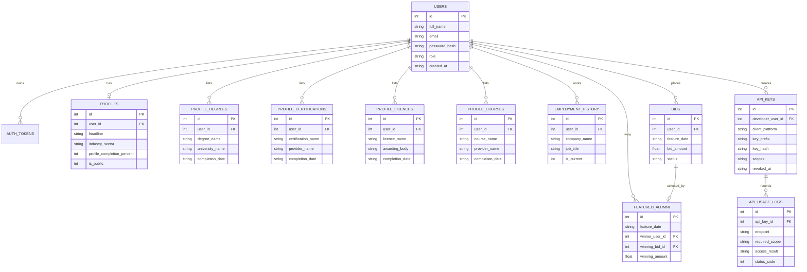

# Entity Relationship Diagram

## Notes

- `api_keys.key_hash` stores the SHA-256 hash of the key, not the plaintext key.
- `api_usage_logs` captures permission checks, scope failures, rate-limit events, and successful requests.
- Analytics charts are generated from normalized profile, education, certification, course, and employment tables.
